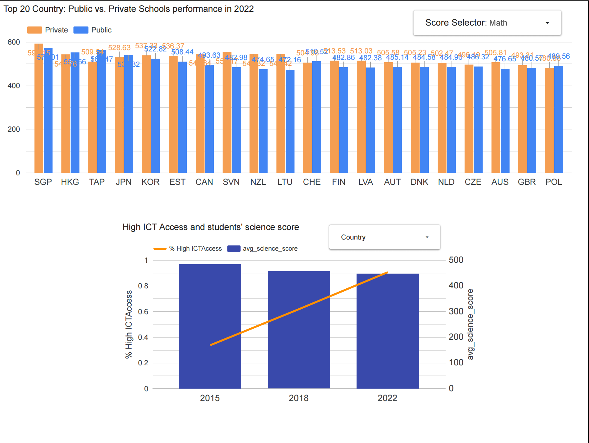

# PISA Analysis

## Analysis Objects:
- Categorical Analysis: Public vs. Private Schools  
  _"Do private schools consistently outperform public schools across countries?"_
- Temporal Analysis: Digital Resources vs. Science **Scores**  
  _"How has access to digital resources (e.g., computers) impacted science scores over time?"_

##Dashboard  
https://lookerstudio.google.com/s/p3Spjz5r__I



### Prerequisites
1. Google platform account
   - A project ID.
   - A service account with right permissions to Cloud Storage and BigQuery.
   - Credential key linked to the service account is saved locally to a JSON file.
2. Docker installed
3. terraform installed 

### Steps to run the project:

1. Clone the repo.
2. Run terraform to create a GCP bucket and BigQuery datasets.
```
    export GOOGLE_APPLICATION_CREDENTIALS="/c/Users/user_name/2025_Data_Engineering/tmp/key.json"
    cd terraf/
    terraform init
    terraform plan 
    terraform apply
```
3. Bring up Kestra using docker compose
```
    docker compose up
```

4. Create necessary KVs in Kestra, which will be used to access GCP, and copy/load the flow file into Kestra
   - KV1: Google cloud project ID
   - KV2: Google cloud service account credentilal
   - KV3: Location used when creating the GCS bucket.
   - KV4: GCS bucket name.
   - Copy or load kestra_data_ingestion.yaml

5. Excute the data ingestion flow, to get necessary data files.
   - PISA 2022 student file
   - PISA 2022 school file
   - PISA 2018 student file
   - PISA 2015 student file

6. Create a dbt project, and clone or copy dbt folder into the project, then build the models.   
   (Since this project is to analyze historical data, and PISA only updates it's data every 3 years, there is no scheduled job)
```
    dbt deps
    dbt run-operation stage_external_sources
    dbt build
```

7. Open Looker studio, add data sources as below, then create the column chart and compo chart respectively:
    - fact_school_type_performance.yml
    - fact_ict_science.yml
